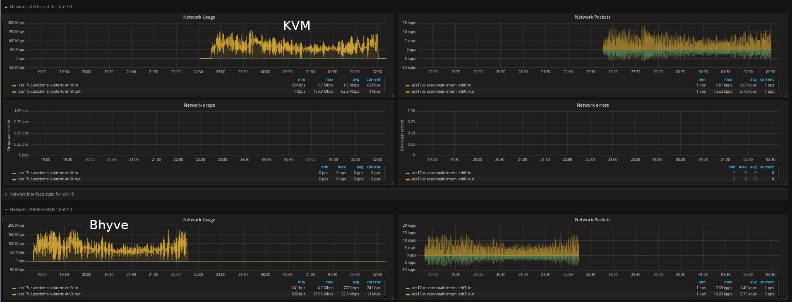

Requirement
===========

* a working vm
* a kvm and a bhyve xml template
* a bhyve zfs clone from an kvm zfs snapshot
* the vm runs in a separate zpool (called: extra) not as usual under (called: zones)
* smartos machine with 64 gb ram

```
[root@assg9-labor ~]# cd /opt

[root@assg9-labor /opt]# zpool status extra
  pool: extra
 state: ONLINE
  scan: none requested
config:

        NAME                       STATE     READ WRITE CKSUM
        extra                      ONLINE       0     0     0
          mirror-0                 ONLINE       0     0     0
            c0t500140000000000000  ONLINE       0     0     0
            c0t500140000000000001  ONLINE       0     0     0
        logs
          c0t500250000000000000    ONLINE       0     0     0
        cache
          c0t500250000000000001    ONLINE       0     0     0

errors: No known data errors
[root@assg9-labor /opt]#

[root@assg9-labor /opt]# zfs list | grep 0001
extra/0001576e-d4f4-e226-de14-9e62eb170c7e              9,93G   662G  9,93G  /extra/0001576e-d4f4-e226-de14-9e62eb170c7e
extra/0001576e-d4f4-e226-de14-9e62eb170c7e-disk0         549G   662G   549G  -
extra/0001576e-d4f4-e226-de14-9e62eb170c7e-disk0_bhyve     8K   662G   549G  -
extra/0001576e-d4f4-e226-de14-9e62eb170c7e-disk1        1,25M   662G  1,18M  -
extra/0001576e-d4f4-e226-de14-9e62eb170c7e-disk1_bhyve     8K   662G  1,18M  -
[root@assg9-labor /opt]#

[root@assg9-labor /opt]# zfs list -t snapshot | grep 0001
extra/0001576e-d4f4-e226-de14-9e62eb170c7e@_EXPORT              132K      -  9,93G  -
extra/0001576e-d4f4-e226-de14-9e62eb170c7e@_KVM                 132K      -  9,93G  -
extra/0001576e-d4f4-e226-de14-9e62eb170c7e-disk0@_EXPORT        118M      -   549G  -
extra/0001576e-d4f4-e226-de14-9e62eb170c7e-disk0@_KVM          19,5M      -   549G  -
extra/0001576e-d4f4-e226-de14-9e62eb170c7e-disk0_bhyve@_CLONE     8K      -   549G  -
extra/0001576e-d4f4-e226-de14-9e62eb170c7e-disk0_bhyve@_BHYVE  21,3M      -   549G  -
extra/0001576e-d4f4-e226-de14-9e62eb170c7e-disk1@_CLEAN          56K      -    56K  -
extra/0001576e-d4f4-e226-de14-9e62eb170c7e-disk1@_KVM          1,09M      -  1,18M  -
extra/0001576e-d4f4-e226-de14-9e62eb170c7e-disk1_bhyve@_CLONE     8K      -  1,18M  -
extra/0001576e-d4f4-e226-de14-9e62eb170c7e-disk1_bhyve@_BHYVE  1,11M      -  1,19M  -
[root@assg9-labor /opt]#

[root@assg9-labor /opt]# ls -allt /etc/zones | grep 0001
-rw-r--r--   1 root     root        6139 Juli 31 08:00 0001576e-d4f4-e226-de14-9e62eb170c7e.xml
-rw-r--r--   1 root     root        6139 Juli 31 08:00 0001576e-d4f4-e226-de14-9e62eb170c7e.xml.KVM
-rw-r--r--   1 root     root        6207 Juli 31 08:00 0001576e-d4f4-e226-de14-9e62eb170c7e.xml.BHYVE
[root@assg9-labor /opt]#
```

Example: KVM
============

```
[root@assg9-labor /opt]# ./run-ci-debug-kvm-vs-bhyve-performance.sh kvm
RUN
[  OK  ] 'clean up old zlogins'
Successfully completed stop for VM 0001576e-d4f4-e226-de14-9e62eb170c7e
[  OK  ] 'stopping VM 0001576e-d4f4-e226-de14-9e62eb170c7e'
Cannot find running init PID for VM 0001576e-d4f4-e226-de14-9e62eb170c7e
[WARNING] 'killing VM 0001576e-d4f4-e226-de14-9e62eb170c7e'
VM 0001576e-d4f4-e226-de14-9e62eb170c7e is already not 'running' (currently: stopped)
Successfully updated VM 0001576e-d4f4-e226-de14-9e62eb170c7e
0001576e-d4f4-e226-de14-9e62eb170c7e  KVM   32768    stopped           EXTRA-assg9-all-kvm-sap-ass17uc_KVM
[  OK  ] 'clean up KVM environment'
Successfully started VM 0001576e-d4f4-e226-de14-9e62eb170c7e
0001576e-d4f4-e226-de14-9e62eb170c7e  KVM   32768    running           EXTRA-assg9-all-kvm-sap-ass17uc_KVM

if that's a KVM vm, use now: KVM PORT 30002

[  OK  ] 'starting VM 0001576e-d4f4-e226-de14-9e62eb170c7e'

debug-kvm-vs-bhyve-performance finished.
[root@assg9-labor /opt]#
```

Example: BHYVE
==============

```
[root@assg9-labor /opt]# ./run-ci-debug-kvm-vs-bhyve-performance.sh bhyve
RUN
[  OK  ] 'clean up old zlogins'
Successfully completed stop for VM 0001576e-d4f4-e226-de14-9e62eb170c7e
[  OK  ] 'stopping VM 0001576e-d4f4-e226-de14-9e62eb170c7e'
Cannot find running init PID for VM 0001576e-d4f4-e226-de14-9e62eb170c7e
[WARNING] 'killing VM 0001576e-d4f4-e226-de14-9e62eb170c7e'
VM 0001576e-d4f4-e226-de14-9e62eb170c7e is already not 'running' (currently: stopped)
Successfully updated VM 0001576e-d4f4-e226-de14-9e62eb170c7e
0001576e-d4f4-e226-de14-9e62eb170c7e  BHYV  32768    stopped           EXTRA-assg9-all-kvm-sap-ass17uc_BHYVE
[  OK  ] 'clean up BHYVE environment'
Successfully started VM 0001576e-d4f4-e226-de14-9e62eb170c7e
0001576e-d4f4-e226-de14-9e62eb170c7e  BHYV  32768    running           EXTRA-assg9-all-kvm-sap-ass17uc_BHYVE

if that's a BHYVE vm, use now: zlogin -C 0001576e-d4f4-e226-de14-9e62eb170c7e

[  OK  ] 'starting VM 0001576e-d4f4-e226-de14-9e62eb170c7e'

debug-kvm-vs-bhyve-performance finished.
[root@assg9-labor /opt]#
```

Background: Migration KVM to Bhyve - Performance Issue
======================================================

* Migration KVM to Bhyve - Performance Issue
* https://www.listbox.com/member/archive/184463/2018/05/sort/time_rev/page/1/entry/15:53/20180526083533:4614CC0C-60E1-11E8-BCEA-D063FB890C43/

```
(from 26 May 2018)

Hi,

we have converted the first VMs to Bhyve (SuSE 12 SP3 KVMs for SAP); reproducible steps:

    1. add serial console output support inside the SuSE KVM vm
        vi /etc/default/grub
            GRUB_CMDLINE_LINUX_DEFAULT=" console=tty0 console=ttyS0,115200n8 tsc=reliable earlyprintk"
        grub-mkconfig
        update-grub optionally per YaST
    2. shutdown the SuSE KVM
    3. modify the /etc/zones/UUID.xml
        replace in the first line of <zone name> the brand="kvm" to brand="bhyve"
        remove all KVM related entries like "vnc-port" ... and so on
        resize the "zone.max-shm-memory" to a smaller value
        add the following Bhyve related entries:
            <attr name="com1" type="string" value="/dev/zconsole"/>
            <attr name="com2" type="string" value="socket,/tmp/vm.ttyb"/>
            <attr name="zlog-mode" type="string" value="g--"/>
            <attr name="zlog-name" type="string" value="platform.log"/>
    4. replace in /etc/zones/index the type to :bhyve:ex
    5. update the RAM value for the VM
        vmadm update UUID ram=32786
    6. boot up the Bhyve converted VM now
        vmadm start UUID
    7. zlogin -C UUID
    8. change the "network interface type" configs inside the SuSE Bhyve VM

We performed a SAP database backup and observed different performance measurements in Grafana

    KVM delivered more constant data speeds

SmartOS Hypervisor: 2x HDD zones mirror + 2x SSD logs mirror + 1x SSD cache

ASS: ASS17uc as KVM

    we get twice the reading speed ~ avg 60 MB/s
    we get twice the disk io time ~ 2 Minutes

ASS: ASS17uc as Bhyve
```


23.01.2019 (ass-build-20190119T113233Z) current status was after 6 months of development and many joyent fixes for bhyve
========================================================================================================================

* the speed is now approximately equal

* https://us-east.manta.joyent.com/Joyent_Dev/public/SmartOS/smartos.html#20181220T002304Z
* https://us-east.manta.joyent.com/Joyent_Dev/public/SmartOS/smartos.html#20181206T012147Z
* https://us-east.manta.joyent.com/Joyent_Dev/public/SmartOS/smartos.html#20181121T182506Z
* https://us-east.manta.joyent.com/Joyent_Dev/public/SmartOS/smartos.html#20181108T015750Z





